## Задача 1
https://hub.docker.com/repository/docker/corwin71/custom-nginx/general

## Задача 2

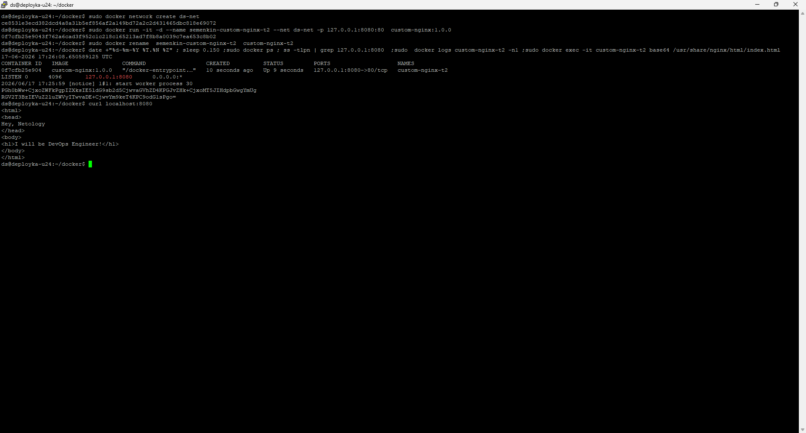
## Задача 3

sudo docker attach 0f7cfb25e904
Ctrl+C отправляет сигнал SIGINT, который прерывает работу контейнера

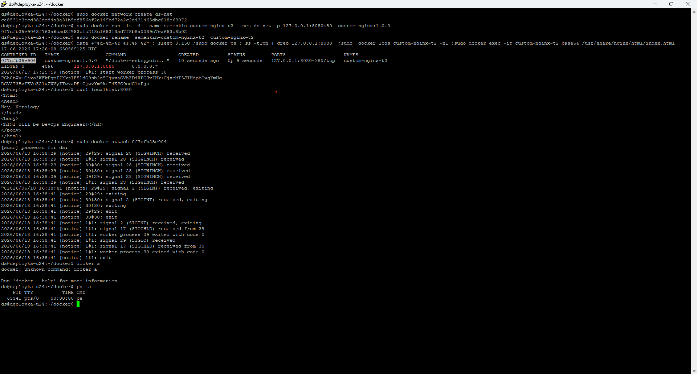
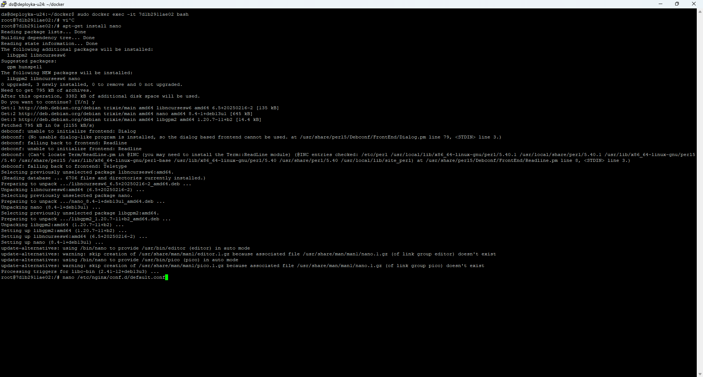
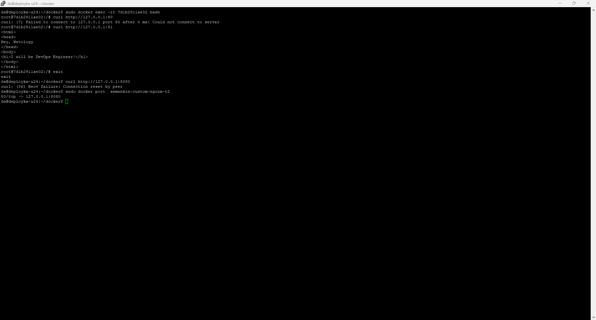
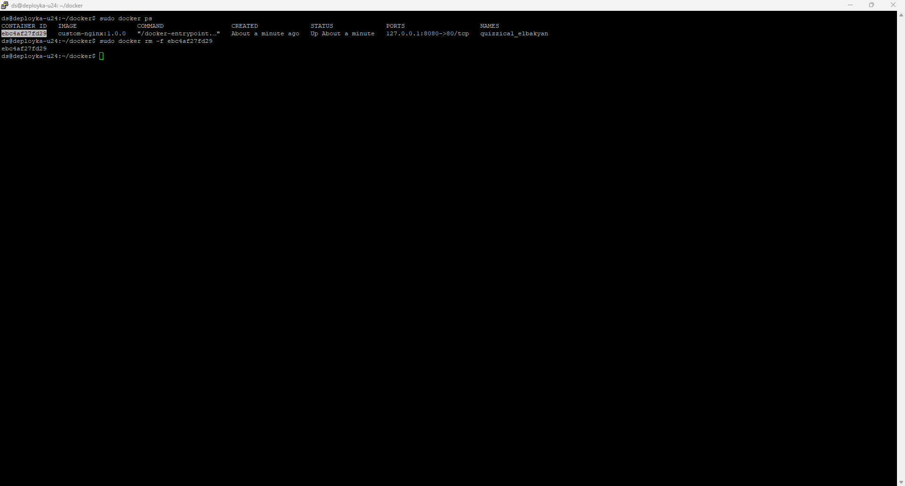

## Задача 4
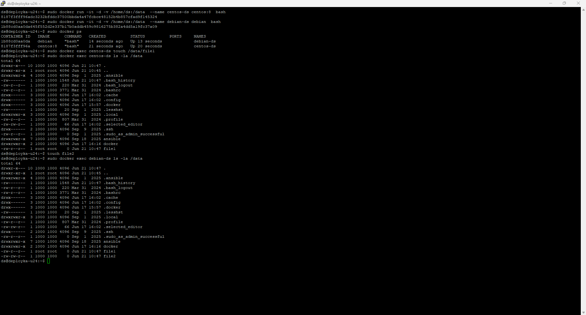

compose.yaml

version: "3"
include:
- docker-compose.yaml
services:
  portainer:
    network_mode: host
    image: portainer/portainer-ce:latest
    volumes:
      - /var/run/docker.sock:/var/run/docker.sock

Запустился контейнер  task-portainer-1, т.к у Compose предпочтительный compose.yaml. Остальные файлы оставлены для совместимости

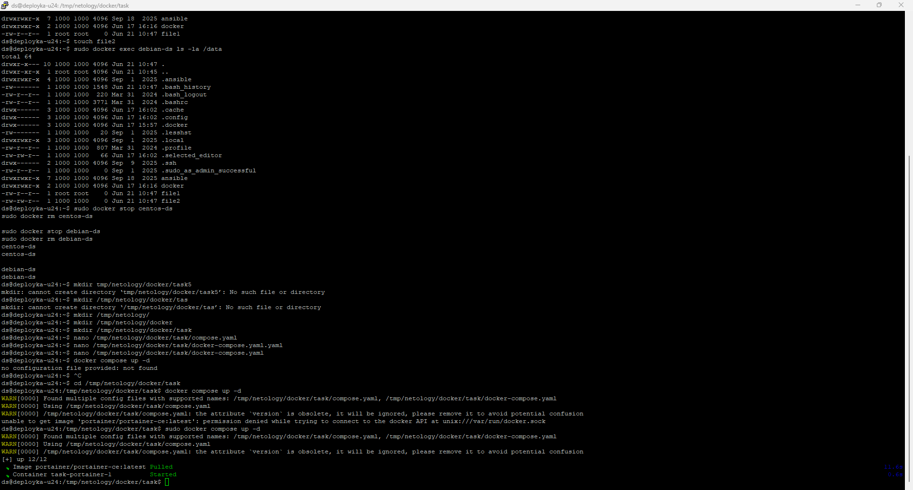
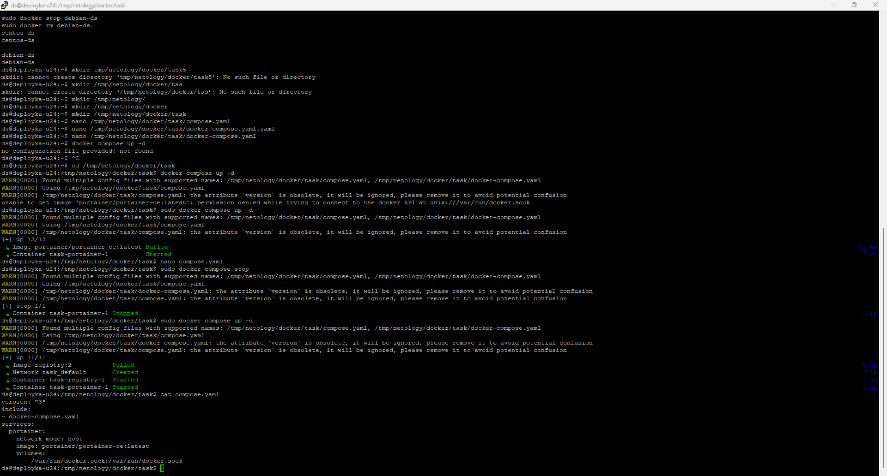
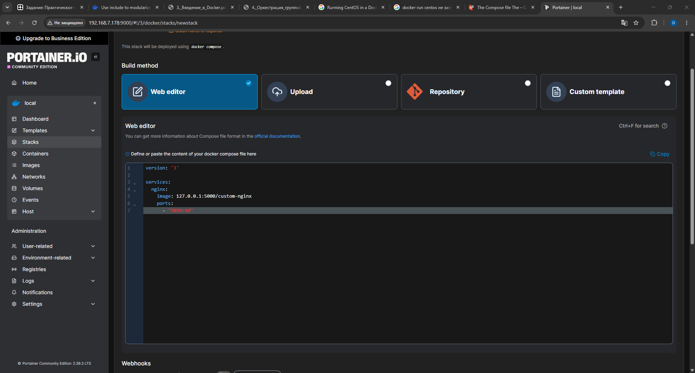
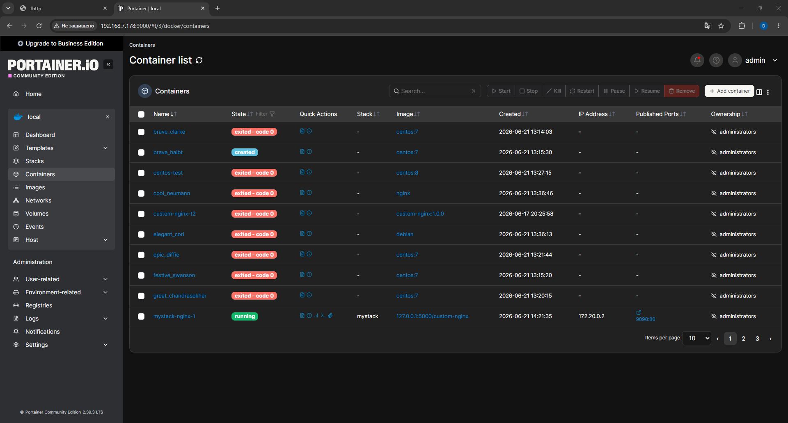
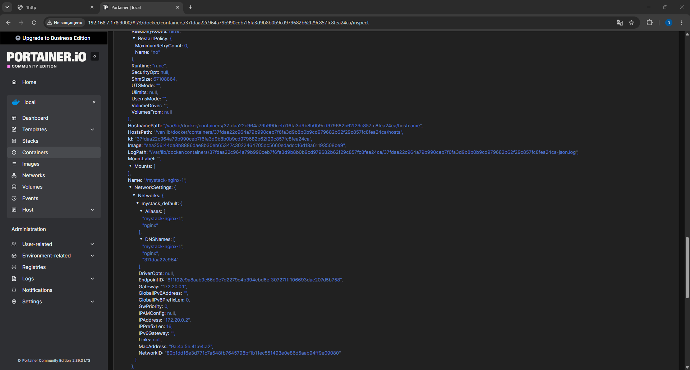
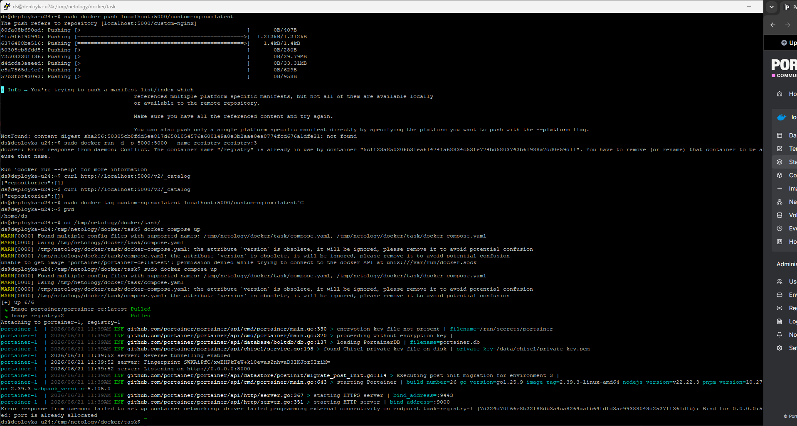

