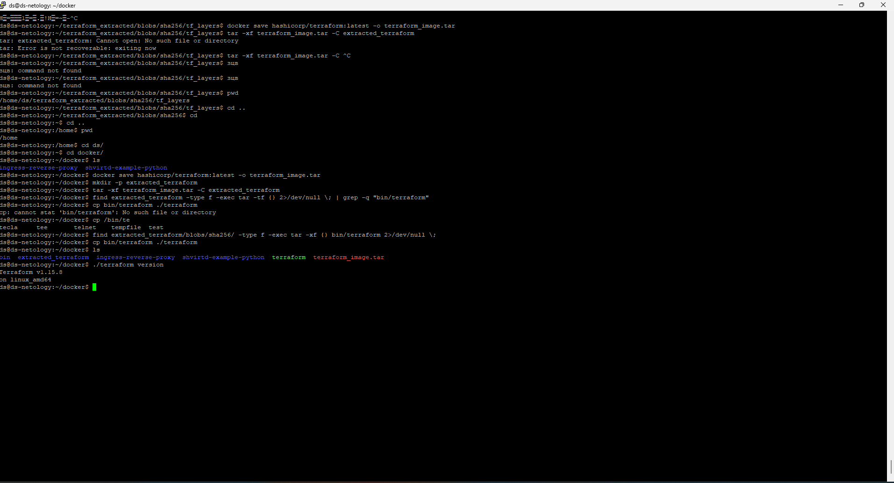

## Задача 0

## Задача 1
https://github.com/corwin71/shvirtd-example-python.git

## Задача 2
https://github.com/corwin71/devops_netology/blob/main/%D0%94%D0%BE%D0%BC%D0%B0%D1%88%D0%BD%D0%B5%D0%B5%20%D0%B7%D0%B0%D0%B4%D0%B0%D0%BD%D0%B8%D0%B5%20%D0%BA%20%D0%B7%D0%B0%D0%BD%D1%8F%D1%82%D0%B8%D1%8E%205.%20%C2%AB%D0%9F%D1%80%D0%B0%D0%BA%D1%82%D0%B8%D1%87%D0%B5%D1%81%D0%BA%D0%BE%D0%B5%20%D0%BF%D1%80%D0%B8%D0%BC%D0%B5%D0%BD%D0%B5%D0%BD%D0%B8%D0%B5%20Docker%C2%BB/%D0%97%D0%B0%D0%B4%D0%B0%D1%87%D0%B0%202/vulnerabilities.csv

## Задача 3

## Задача 4

https://github.com/corwin71/shvirtd-example-python.git

## Задача 6

docker save hashicorp/terraform:latest -o terraform_image.tar
mkdir -p extracted_terraform
tar -xf terraform_image.tar -C extracted_terraform
find extracted_terraform/blobs/sha256/ -type f -exec tar -xf {} bin/terraform 2>/dev/null \;
cp bin/terraform ./terraform
./terraform version

